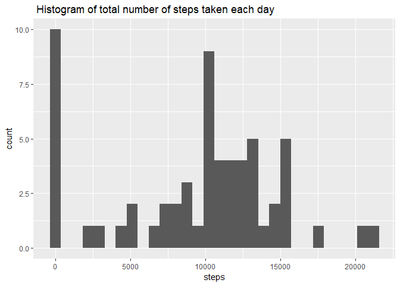
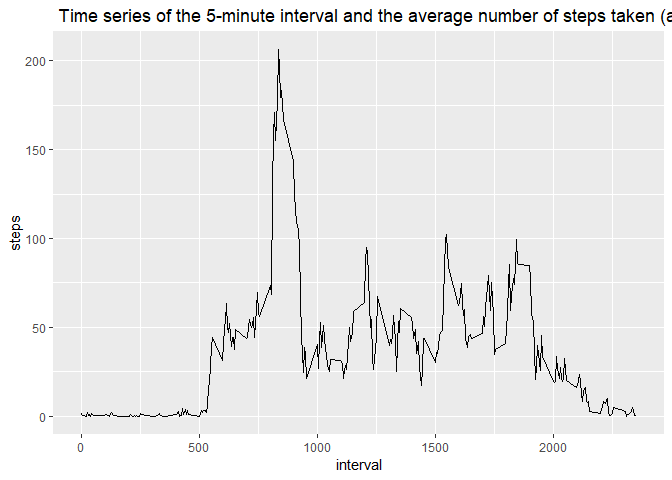
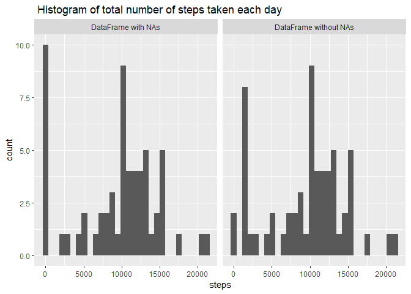
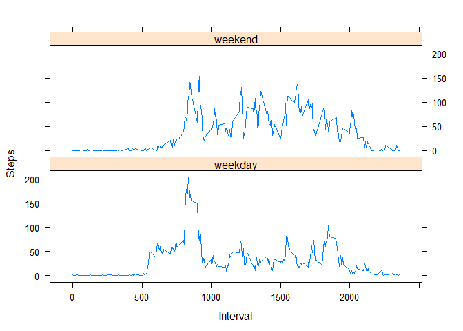

### **Loading and preprocessing the data**
##### **1. Load the data**

```r
library(rmarkdown)   # load library for rmarkdown
```

```
## Warning: package 'rmarkdown' was built under R version 3.5.3
```

```r
library(lubridate)  # load library for data parsing
```

```
## 
## Attaching package: 'lubridate'
```

```
## The following object is masked from 'package:base':
## 
##     date
```

```r
library(ggplot2) # for plotting
library(zoo) # too fill nas
```

```
## 
## Attaching package: 'zoo'
```

```
## The following objects are masked from 'package:base':
## 
##     as.Date, as.Date.numeric
```
##### **2. Process/transform the data (if necessary) into a format suitable for your analysis**

```r
df <- read.csv("./activity.csv") # read dataframe
df$date = ymd(df$date)  # date to date format
print(head(df)) # print head
```

```
##   steps       date interval
## 1    NA 2012-10-01        0
## 2    NA 2012-10-01        5
## 3    NA 2012-10-01       10
## 4    NA 2012-10-01       15
## 5    NA 2012-10-01       20
## 6    NA 2012-10-01       25
```


### **What is mean total number of steps taken per day?**
##### **1. Make a histogram of the total number of steps taken each day**

```r
# Aggregate
steps_each_day <- aggregate(df$steps, by = list(date = df$date), FUN = sum, na.rm=TRUE)

# Plot on screen

print(ggplot(steps_each_day, aes(x=x)) + geom_histogram() + ggtitle(" Histogram of total number of steps taken each day") + xlab("steps"))
```

```
## `stat_bin()` using `bins = 30`. Pick better value with `binwidth`.
```

<!-- -->

##### **2. Calculate and report the mean and median total number of steps taken per day**

```r
mean_steps_each_day <- mean(steps_each_day$x)
print(paste("The mean of the number of steps each day is:",mean_steps_each_day))
```

```
## [1] "The mean of the number of steps each day is: 9354.22950819672"
```

```r
median_steps_each_day <- median(steps_each_day$x)
print(paste("The median of the number of steps each day is:",median_steps_each_day))
```

```
## [1] "The median of the number of steps each day is: 10395"
```

### **What is the average daily activity pattern?**
##### **1. Make a time series plot of the 5-minute interval (x-axis) and the average number of steps taken, averaged across all days (y-axis)**

```r
steps_each_interval <- aggregate(df$steps, by = list(interval = df$interval), FUN = mean, na.rm=TRUE)
ggplot(steps_each_interval, aes(x=interval, y = x)) + geom_line() + ggtitle(" Time series of the 5-minute interval and the average number of steps taken (averaged across all days)") + xlab("interval") + ylab("steps")
```

<!-- -->

##### **2. Which 5-minute interval, on average across all the days in the dataset, contains the maximum number of steps?**

```r
max_steps_interval <- steps_each_interval[which.max(steps_each_interval$x),'interval']
print(paste("The following 5-minute interval, on average across al the days in the dataset, contains the maximum number of steps:",max_steps_interval))
```

```
## [1] "The following 5-minute interval, on average across al the days in the dataset, contains the maximum number of steps: 835"
```

### **Imputing missing values**
##### **1. Calculate and report the total number of missing values in the dataset (i.e. the total number of rows with NAs)**

```r
nas_per_col <- apply(df, MARGIN = 2, function(x) sum(is.na(x)))
print(paste("The total number of rows with NAs are:", sum(nas_per_col)))
```

```
## [1] "The total number of rows with NAs are: 2304"
```

##### **2. Devise a strategy for filling in all of the missing values in the dataset. The strategy does not need to be sophisticated. For example, you could use the mean/median for that day, or the mean for that 5-minute interval, etc.**
##### **3. Create a new dataset that is equal to the original dataset but with the missing data filled in.**


```r
# Fill with mean steps of each day (divided by total nr of intervals)
df_new <- df
df_new[is.na(df_new$steps), 'steps'] <- mean_steps_each_day /2355

# Check how many NAs
nas_per_col <- apply(df_new, MARGIN = 2, function(x) sum(is.na(x)))
print(paste("The total number of rows with NAs are:", sum(nas_per_col)))
```

```
## [1] "The total number of rows with NAs are: 0"
```


##### **4. Make a histogram of the total number of steps taken each day and Calculate and report the mean and median total number of steps taken per day. Do these values differ from the estimates from the first part of the assignment? What is the impact of imputing missing data on the estimates of the total daily number of steps?**

```r
# Merge dataframes to show in one plot
df$source <- "DataFrame with NAs"
df_new$source <- "DataFrame without NAs"
df_merged <- rbind(df, df_new)

# Plot with facets
steps_each_day <- aggregate(df_merged$steps, by = list(date = df_merged$date, source = df_merged$source), FUN = sum, na.rm=TRUE)
ggplot(steps_each_day, aes(x=x)) + geom_histogram(bins = 30) + ggtitle(" Histogram of total number of steps taken each day") + xlab("steps") + facet_wrap(~source)
```

<!-- -->


### **Are there differences in activity patterns between weekdays and weekends?**
##### **1. Create a new factor variable in the dataset with two levels -- "weekday" and "weekend" indicating whether a given date is a weekday or weekend day.**

```r
#drop column 
df_new$source <- NULL

#Add day of week column
df_new$day_of_week <- weekdays(df_new$date)

# Define weekdays and weekend vectors
weekdays_vec <- c("maandag", "dinsdag", "woensdag", "donderdag", "vrijdag")
weekenddays_vec <- c("zaterdag", "zondag")

# Add column stating whether its a weekday or weekend
df_new[df_new$day_of_week %in% weekdays_vec, 'weekday_or_weekend'] <- "weekday"
df_new[df_new$day_of_week %in% weekenddays_vec, 'weekday_or_weekend'] <- "weekend"
df_new$weekday_or_weekend <- as.factor(df_new$weekday_or_weekend)

# Print number of weekdays and weekend days
table(df_new$weekday_or_weekend)
```

```
## 
## weekday weekend 
##   12960    4608
```

##### **2. Make a panel plot containing a time series plot (i.e. type = "l") of the 5-minute interval (x-axis) and the average number of steps taken, averaged across all weekday days or weekend days (y-axis).**

```r
library(lattice)

# aggregate
df_agg <- aggregate(df_new$steps, by = list(weekday_or_weekend = df_new$weekday_or_weekend, interval = df_new$interval), FUN = mean, na.rm=TRUE)

#plot
xyplot(x ~ interval | weekday_or_weekend, data = df_agg, type = "l", xlab = "Interval", ylab = "Steps", layout = c(1, 2))
```

<!-- -->
